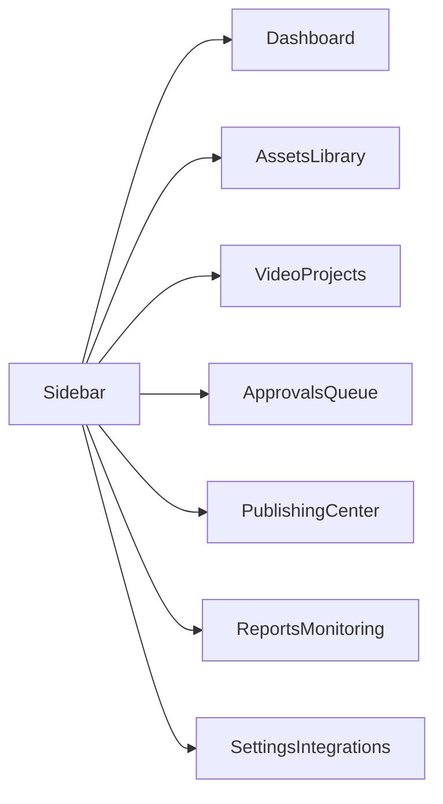
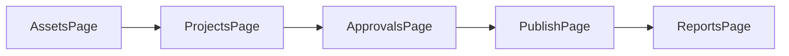

# Admin UX va wireframe

## Muc tieu UX

- Mot dashboard trung tam cho content ops.
- Moi man hinh phan ro theo workflow thay vi theo cau truc ky thuat.
- Cho phep operator nhin thay job, loi va hanh dong tiep theo trong 1 lan xem.

## Dieu huong chinh

- Dashboard
- Assets
- Projects
- Approvals
- Publish
- Reports
- Settings

## Wireframe tong quan

## 1. Dashboard

### Muc tieu

- Hien KPI tong.
- Hien queue suc khoe he thong.
- Hien danh sach viec can xu ly ngay.

### Thanh phan

- KPI cards: render jobs, publish success, active alerts.
- Workflow summary theo state.
- Bang canh bao token va queue backlog.
- Recent failures feed.

## 2. Assets

### Muc tieu

- Tim va quan ly asset theo SKU, campaign, tag.
- Nhanh chong biet asset nao da san sang render.

### Thanh phan

- Thanh tim kiem theo SKU/title.
- Bo loc theo channel, quality gate, upload date.
- Table/grid asset.
- Preview panel ben phai.
- CTA: upload, batch import, gan product.

## 3. Projects

### Muc tieu

- Quan ly toan bo video project va trang thai render.
- Cho phep vao chi tiet project de re-render, doi template, doi brand kit.

### Thanh phan

- List project.
- Status chips.
- Bulk actions.
- Preview + metadata panel.
- Timeline cua workflow.

## 4. Approvals

### Muc tieu

- Kiem duyet nhanh cac video AI co nguy co compliance.
- Theo doi comment va quyet dinh cua reviewer.

### Thanh phan

- Hang doi video can duyet.
- Video player + subtitle + caption.
- Checklist compliance:
  - affiliate disclosure
  - product claims
  - brand safety
  - music/source rights
- Nut approve / reject / request changes.

## 5. Publish

### Muc tieu

- Lap lich dang da kenh.
- Kiem tra product mapping, affiliate link va account readiness.

### Thanh phan

- Publish queue table.
- Channel account health.
- Status theo channel capability.
- Retry history.
- Manual fallback package.

## 6. Reports

### Muc tieu

- Hien hieu suat van hanh va KPI kinh doanh.
- Tach ro operational metrics va business metrics.

### Thanh phan

- Render latency chart.
- Publish success/failure trend.
- AI cost by campaign.
- Top SKU by output volume.
- Token expiry va integration errors.

## User flow chinh

## Ghi chu trien khai

- Cac route khung da duoc scaffold trong `apps/web/src/app`.
- Giai doan tiep theo la noi API that va them auth/RBAC.
