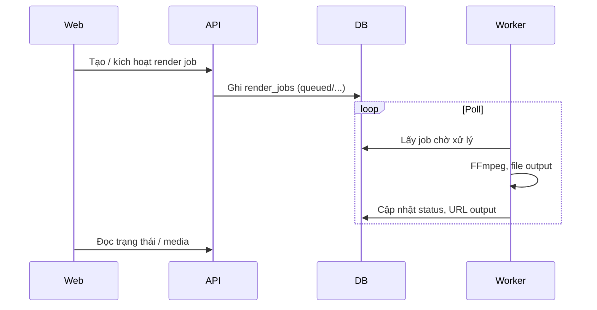

# Roadmap & tổng quan vận hành dự án

Tài liệu này giúp bạn **nhìn một lượt**: cấu trúc repo, cách các thành phần nói chuyện với nhau, và **lộ trình phase** (đã làm / đang mở). Chi tiết sâu hơn nằm ở [architecture.md](./architecture.md), [phase-roadmap.md](./phase-roadmap.md), [product-requirements.md](./product-requirements.md).

---

## 1. Cấu trúc monorepo (điều gì ở đâu)

| Thư mục / package | Vai trò |
|-------------------|--------|
| `apps/web` | Next.js — web admin: đăng nhập, dashboard, CRUD sản phẩm / asset / project, duyệt, publish, kênh, báo cáo. Gọi API qua `NEXT_PUBLIC_API_BASE_URL`. |
| `apps/api` | Node + HTTP: auth JWT-style, tenant context, CRUD domain, upload/presign object storage, OAuth TikTok/Shopee/Facebook (start + callback), mock provider, dashboard aggregates, webhook publish. |
| `apps/worker` | Tiến trình poll PostgreSQL: lấy `render_jobs` / `publish_jobs`, chạy FFmpeg render, gọi HTTP **publish adapter** (env URL hoặc mock), refresh token khi cần. |
| `packages/domain` | Kiểu dữ liệu / enum dùng chung (domain model nhẹ). |
| `infra/docker-compose.yml` | Postgres, Redis, MinIO local. |
| `docs/` | PRD, kiến trúc, UX, roadmap, runbook demo, env production. |

**Luồng dữ liệu tóm tắt:** Web và Worker đều phụ thuộc **API + DB**; Worker **không** phục vụ trực tiếp browser. Media output render có thể lưu local hoặc S3-compatible (cấu hình ở API).

---

## 2. Cách thức hoạt động (end-to-end)

### 2.1. Người dùng & tenant

1. User đăng nhập → API xác thực, trả token.
2. Mọi request CRUD mang token; API resolve `tenantId` (multi-tenant).
3. Seed / demo: xem [demo-runbook.md](./demo-runbook.md).

### 2.2. Nội dung: sản phẩm → asset → project

- **Product / Asset:** API + web; asset có thể upload trực tiếp hoặc presigned lên object storage.
- **Video project:** gắn product, template, trạng thái workflow (vd. review).
- **Approval:** reviewer quyết định; API lưu bản ghi approval.

### 2.3. Render video (worker + FFmpeg)

Worker coi DB là **hàng đợi**: không bắt buộc Redis cho luồng tối thiểu hiện tại (Redis trong compose phục vụ mở rộng / cache sau này).

### 2.4. Publish đa kênh (TikTok / Shopee / Facebook) và affiliate

1. Web tạo **publish job** (caption, hashtag, công bố quảng cáo, **liên kết affiliate**, account kênh…). Sản phẩm có thể lưu affiliate tham chiếu (`affiliate_source_url`, `affiliate_program`) — xem [affiliate-crosspost.md](./affiliate-crosspost.md).
2. Worker đọc job, lấy **channel_account** (token), có thể refresh token qua URL cấu hình.
3. Worker `POST` JSON tới `TIKTOK_PUBLISH_URL` / `SHOPEE_PUBLISH_URL` / `FACEBOOK_PUBLISH_URL` (hoặc mock nội bộ); body mở rộng theo [provider-bff-contract.md](./provider-bff-contract.md).
4. API có **publish_attempts**, **webhook** (mô phỏng / tích hợp) để theo dõi.

OAuth thật: authorize/token URL + client id/secret — bảng đầy đủ trong [env-production.md](./env-production.md). Nếu API thật của nền tảng khác format body/response, cần **BFF/proxy** hoặc chỉnh adapter trong code.

### 2.5. Dashboard & sức khỏe tích hợp

- API tổng hợp metrics / health (vd. OAuth, provider) cho trang chủ admin.
- Web chỉ hiển thị dữ liệu đã tổng hợp; không embed logic tenant nặng.

---

## 3. Roadmap theo phase — trạng thái thực tế (repo hiện tại)

Bảng dưới **ăn khớp với code đã có**, để phân biệt “đã scaffold” và “còn việc product/platform”.

| Phase | Nội dung | Trạng thái trong repo |
|-------|----------|------------------------|
| **0 – Discovery** | PRD, UX, kiến trúc, rủi ro tích hợp | Tài liệu trong `docs/` |
| **1 – Foundation** | Monorepo, web/api/worker shell, domain, Docker infra | **Đã có** |
| **2 – Core product** | Auth, tenant, CRUD product/asset/project, render job trong DB, dashboard có dữ liệu thật | **Đã có** (render thật FFmpeg ở worker) |
| **3 – Workflow** | Approval gate, publish UI, reports cơ bản | **Đã có**; thêm **audit log**, **notification/escalation** (worker ghi khi render/publish fail), **RBAC** theo vai trò |
| **4 – Channel** | Account kênh, OAuth, publish HTTP adapter, retry/cancel, webhook; affiliate trên product + Facebook | **Đã có** khung + mock (TikTok, Shopee, **Facebook**); **BFF thật** theo [provider-bff-contract.md](./provider-bff-contract.md) — triển khai ngoài repo hoặc service riêng |
| **5 – Scale & ops** | Cost attribution, queue scale riêng, SLA alerting nâng cao | **Đã có** ước tính chi phí, `/metrics` (Prometheus), health DB+Redis, **hàng đợi Redis tùy chọn** (`USE_JOB_QUEUE`), **webhook cảnh báo** (`ALERT_WEBHOOK_URL`); **Bull/chồng APM** vẫn tuỳ nhu cầu |

### Khoảng trống so với mô tả phase gốc / integration-audit

| Hạng mục trong tài liệu | Thực tế repo | Gợi ý bổ sung |
|-------------------------|--------------|----------------|
| **CRUD template** (Phase 2) | `template_id` là **chuỗi** trên project, không có bảng/màn quản lý template | Thêm entity `video_templates` + API/UI hoặc điều chỉnh PRD: “template = mã cấu hình” |
| **Brand kit** | Có field `brand_kit_id`, chưa CRUD brand kit | Bảng + API + UI hoặc bỏ khỏi scope MVP |
| **Compliance checklist** (Phase 3) | Có disclosure trên publish + approval; **chưa** checklist nhiều mục / policy lưu DB | Thêm checklist theo kênh hoặc gắn template compliance |
| **Adapter theo capability** (integration-audit) | Một luồng HTTP chung + mock; chưa class `ShopeeAdapter` / `TikTokAdapter` tách capability | Giữ BFF; hoặc refactor worker theo capability khi API ổn định |
| **`product_mapping`, `tracking_params`, `channel_capabilities`** | Affiliate gắn **product** + **publish job**; chưa bảng mapping/params/capability | Thêm khi cần đa SKU–đa kênh hoặc attribution sâu |
| **Đồng bộ trạng thái post từ nền tảng** | Webhook mô phỏng + cập nhật job trong luồng worker | Webhook/BFF thật + idempotency + retry theo spec từng nhà |

### Việc nên ưu tiên tiếp theo (gợi ý)

1. **BFF/production:** triển khai service theo [provider-bff-contract.md](./provider-bff-contract.md), HTTPS, backup DB, logging tập trung (đã có rate limit login cơ bản).
2. **Vận hành:** bật `USE_JOB_QUEUE` + scrape `/metrics`; nối `ALERT_WEBHOOK_URL` tới Slack/n8n.
3. **AI pipeline:** nếu muốn đúng PRD “script/voiceover tự động”, thêm bước worker hoặc service AI (hiện FFmpeg từ asset có sẵn).
4. **Tuỳ chọn nặng:** BullMQ, OpenTelemetry, RBAC tinh chỉnh thêm permission theo từng team.

---

## 4. Mốc thời gian tham khảo

Giữ nguyên hướng dẫn trong [phase-roadmap.md](./phase-roadmap.md) (Phase 0–5 theo tuần). Phần **đã implement** trong repo rút ngắn Phase 1–4 cho mục tiêu MVP nội bộ; thời gian còn lại chủ yếu nằm ở **tích hợp thật**, **compliance**, và **vận hành**.

---

## 5. Liên kết nhanh

| Tài liệu | Mục đích |
|----------|----------|
| [phase-roadmap.md](./phase-roadmap.md) | Chia phase, deliverable, rủi ro (bản gốc theo nhóm chức năng) |
| [architecture.md](./architecture.md) | Blueprint domain, queue, observability |
| [admin-ux.md](./admin-ux.md) | Màn hình admin |
| [demo-runbook.md](./demo-runbook.md) | Chạy demo, reset seed |
| [env-production.md](./env-production.md) | Điền env TikTok/Shopee/Facebook, API/Web/Worker |
| [affiliate-crosspost.md](./affiliate-crosspost.md) | Affiliate, đăng chéo kênh, tuân thủ |
| [provider-bff-contract.md](./provider-bff-contract.md) | JSON BFF phải khớp cho token + publish |

---

*Cập nhật: mô tả trạng thái theo cấu trúc monorepo AppAffilate (web, api, worker, domain, infra).*
